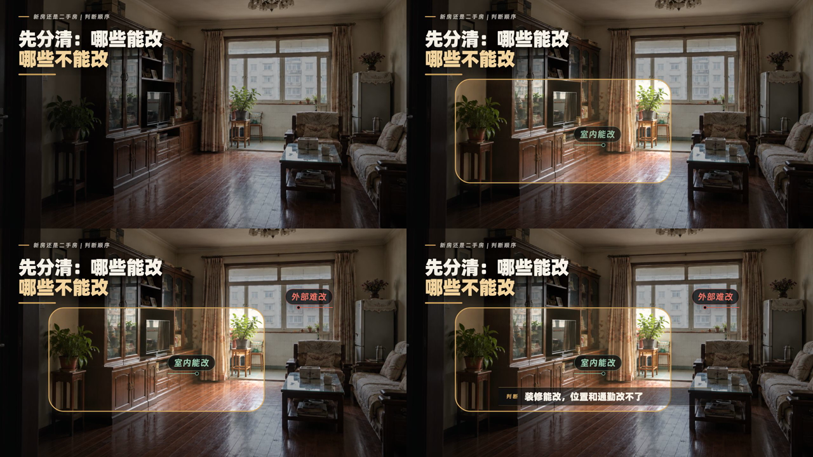
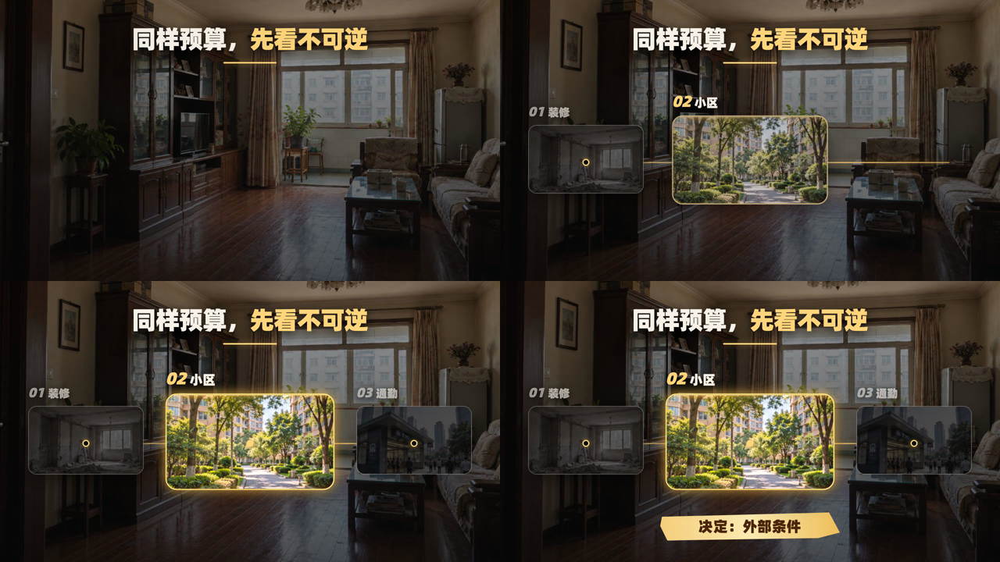
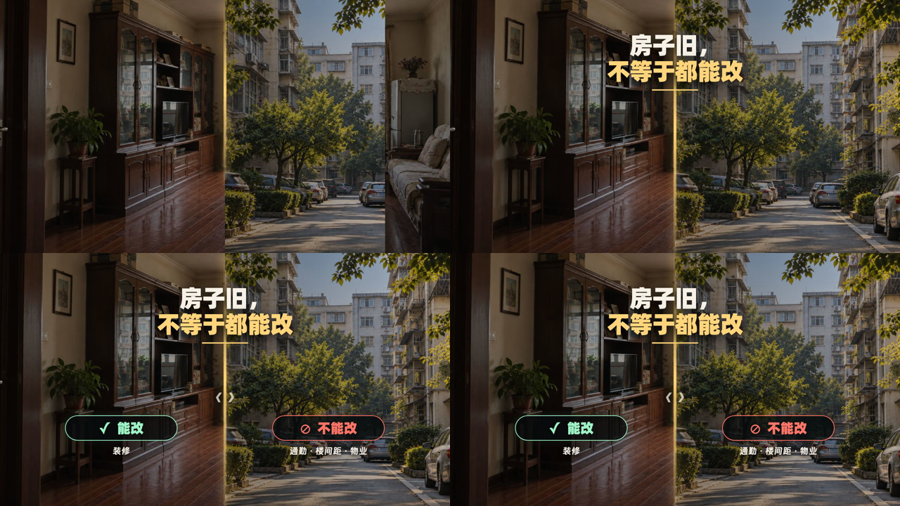

# 分镜素材画面风格模板3.0

面向房产口播分镜插入画面的 Codex Skill 与 Remotion 示例工程。核心目标是保留真实房产场景，通过克制的MG动画解释“判断顺序、可变与不可变、证据和结论”，减少长期使用信息卡片产生的审美疲劳。

## 三种场景引擎

### 场景聚焦窗



适合在一张真实房屋场景内标注局部关系，例如室内能改、采光位置、结构缺陷和外部条件。

### 证据轨道



适合三项判断顺序、优先级和证据链。当前项放大提亮，其他项降低亮度，结尾给出单一判断。

### 语义切分



适合“能改/不能改”“室内/外部”“短期/长期”等二元冲突。分割线和两侧明暗随口播自动变化。

## 仓库内容

- `SKILL.md`：Codex Skill 主入口。
- `references/STYLE_GUIDE.md`：完整视觉与动画规范。
- `references/MOTION_LIBRARY_GUIDE.md`：网页动效转 Remotion 的使用边界。
- `assets/remotion-template/`：Remotion 示例源码、示例素材与依赖清单。
- `assets/previews/`：三种场景引擎的成片抽帧预览。
- `assets/motion-library/`：本地 23 项动效素材库原始文件、截图和登记说明。

## 安装 Skill

将仓库克隆或复制到 Codex Skills 目录：

```bash
git clone https://github.com/pensongchs/storyboard-visual-style-template-3.0.git ~/.codex/skills/storyboard-visual-style-template-3-0
```

随后可使用：

```text
$storyboard-visual-style-template-3-0 为这段房产口播制作分镜画面
```

## 运行 Remotion 示例

先让目标环境中的 Codex 读取 `assets/remotion-template/DEPENDENCIES.md` 并安装依赖，再运行：

```bash
cd assets/remotion-template
npm run studio
```

示例工程包含三个 Composition：

- `StoryboardStyleV3-FocusWindow`
- `StoryboardStyleV3-EvidenceRail`
- `StoryboardStyleV3-SemanticSplit`

## 授权提醒

仓库内第三方动效、示例截图和部分参考素材的许可证尚未核实。公开仓库不代表这些素材自动获得开源或商用授权。正式发布、商用或二次分发前，请阅读 [NOTICE.md](NOTICE.md) 并逐项确认来源许可。
