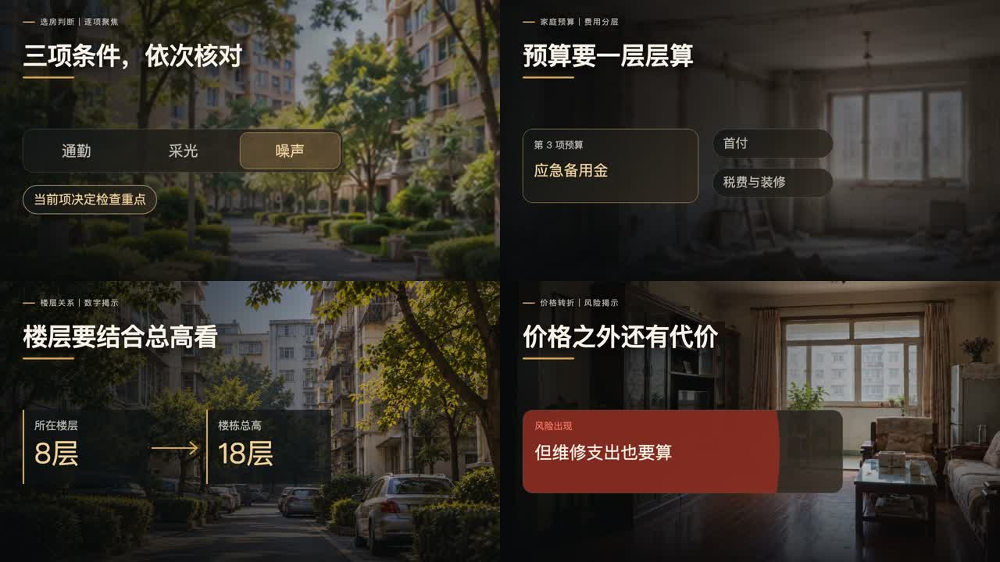

# 分镜素材画面风格模板3.0

这是“极限小滕”当前默认分镜母模板的 Codex Skill。调用后自动按字幕语义匹配动效库，统一材质与节奏，同时使用适合台词的不同解释结构。画面采用“真实城市生活视频或写实图片 + 杂志式信息排版”：实景负责可信度，标题、卡片、数字、节点和关系线负责解释口播。

适用于房产口播插入画面、独立分镜视频和动态图文包装，不用于片头、开场、封面或真人出镜整片。

## 默认模板预览

### 随台词变化的语义动效



四类示例共用模板的材质、色彩和节奏，分别按时间轴推进不同关系；文字、数字、素材和示例时间仅用于组件演示。正式制作按当期台词重新匹配，不固定套用这四镜。

### 排版与语义卡片基线


### 总结镜头与结论层级


### 真实成片：最低价房三次代价


### 真实成片：面积与权属


## 风格核心

- 实景或写实图片占画面约 60%—75%，先让观众看懂场景，再读结论。
- 炭黑、深暖灰、低饱和棕灰为底，暖白为主文字；暖金只用于核心数字、关键词和关系线。
- 一屏只讲一个主要观点，原则上不超过 3 个主要元素。
- 按语义选择珍珠白信息卡、深色玻璃卡、风险红卡、暖金结论胶囊、证据图片卡或 A/B 选择卡。
- 所有元素随口播时间码出现；未讲内容不提前出现，结尾不额外加空镜或淡出。
- 1280×720 基准下保留底部字幕安全区和右侧平台按钮安全区。

完整规范见 [references/STORYBOARD_DESIGN.md](references/STORYBOARD_DESIGN.md)。

## 仓库内容

- `SKILL.md`：Codex Skill 主入口。
- `references/STORYBOARD_DESIGN.md`：当前默认模板的完整规则。
- `assets/remotion-template/src/StoryboardTemplateV2.tsx`：默认母组件与五段排版示例，基础卡片支持多种入场动作。
- `assets/remotion-template/src/SemanticMotion.tsx`：独立实现的选择聚焦、费用分层、数字关系、风险反转组件。
- `assets/remotion-template/src/SemanticMotionShowcase.tsx`：四种语义结构的可运行演示。
- `assets/remotion-template/`：可直接安装依赖并运行的 Remotion 示例工程。
- `assets/previews/`：默认模板基准图与真实成片联系表。
- `assets/motion-library/`：23 项动效素材库原始文件、截图和登记说明。

## 安装 Skill

在 Codex 中发送：

```text
$skill-installer
从 https://github.com/pensongchs/storyboard-visual-style-template-3.0 安装此仓库根目录的 Skill。
```

安装后选择 `storyboard-visual-style-template-3-0`；没有显示时重启 Codex。已安装的学员需要更新原 Skill 目录中的文件，GitHub 更新不会自动替换已下载的旧版本；不要另外安装同名副本。

## 调用并提供本期输入

```text
$storyboard-visual-style-template-3-0
请用我提供的最终文案、SRT 和 Caption JSON 制作分镜素材。
制作范围：整份字幕（或填具体起止时间）。
本地视频：未提供，按 Skill 默认素材模式。
输出：独立 MP4。
```

拖入本期文件，或写清本机实际路径即可。没有时间码时提供音频；只有文案时先做规划。需要带配音的整条视频时明确说明。色彩、字号、构图、动效匹配和成片检查均由 Skill 负责，不需要复制长篇风格指令；特殊要求只说明本期确实不同的部分。短调用不代表单一动画，完整规则在 `SKILL.md` 与对应参考文件中。

## 制作与直接交付

默认由 Codex 在当前项目中制作、后台渲染并完成必要的成片检查，然后直接在对话中展示本地视频、文件链接和简要验证结果。无内嵌播放能力时提供文件链接。只有用户明确要求时才打开 Remotion Studio、外部浏览器或审片台。

## 运行 Remotion 示例

优先复用当前项目已有工程。首次使用独立示例时，让 Codex 从已安装 Skill 的实际目录复制 `assets/remotion-template/` 到当前项目的 `outputs/分镜制作/`；已存在同一工程时直接复用。安装目录只用于读取，不在其中写成片或安装依赖。

仓库不携带本机依赖与字体。由目标环境中的 Codex 读取工作工程的 `DEPENDENCIES.md`，按项目依赖管理规则准备依赖；普通独立工程可执行：

```bash
npm install
npx remotion browser ensure
npm run compositions
npm run still
npm run render
```

五段排版示例保存在工作工程的 `renders/storyboard-template-showcase.mp4`。四种语义动效示例可执行 `npm run render:semantic`，输出为 `renders/semantic-motion-showcase.mp4`。二者是组件使用演示，正式制作须替换台词、素材和字幕时间轴。`npm run studio` 仅用于用户明确要求的交互预览，不是渲染前置步骤。

如果 Chromium 被 Codex 沙箱明确阻止，Codex 应通过执行工具申请仅对所需命令授权，在原工作目录重跑并继续完成交付。浏览器下载、目录写入和启动权限应分别诊断；`browser ensure` 不负责解除沙箱限制。具体处理见 [依赖与运行权限说明](assets/remotion-template/DEPENDENCIES.md)。

## 授权提醒

仓库内第三方动效的许可证尚未逐项核实。公开仓库不代表这些素材自动获得开源或商用授权；正式发布、商用或二次分发前，请阅读 [NOTICE.md](NOTICE.md) 并确认来源许可。
