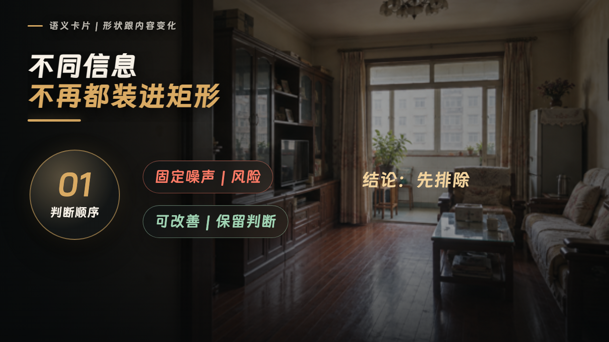
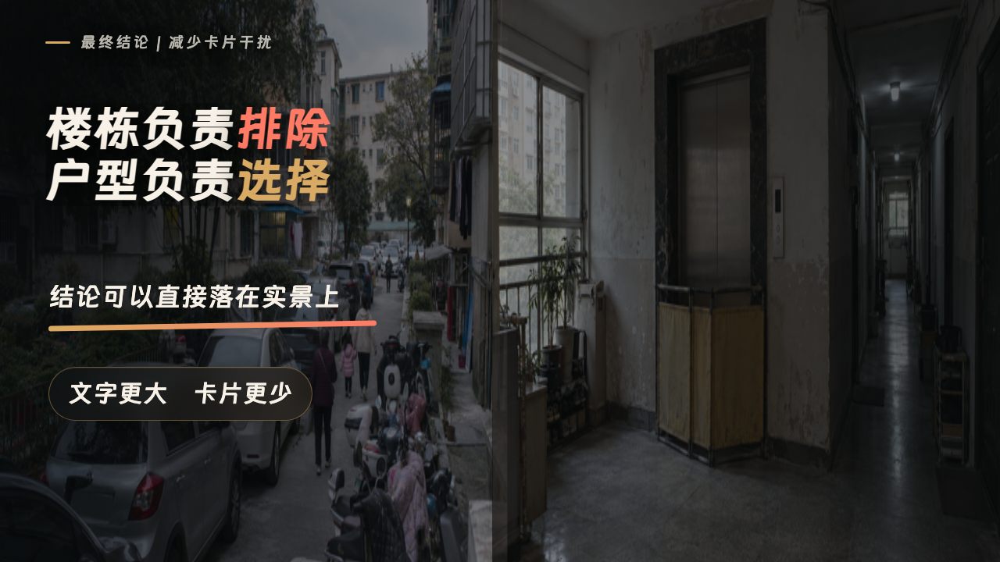
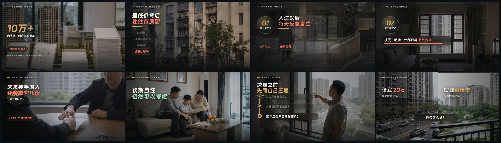
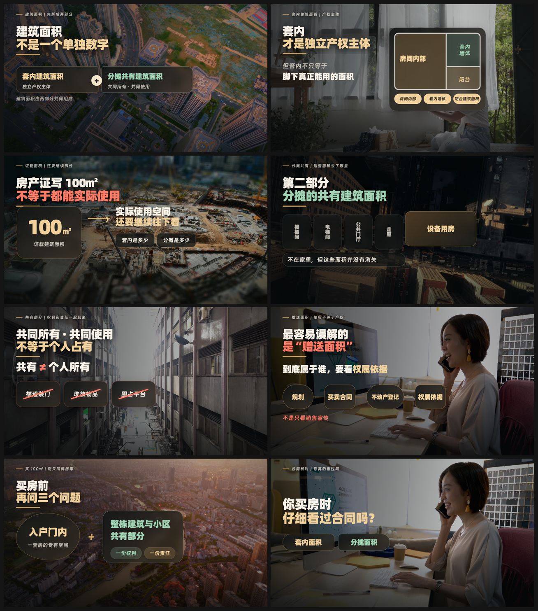

# 分镜素材画面风格模板3.0

这是“极限小滕”当前默认分镜母模板的 Codex Skill。画面采用“真实城市生活视频或写实图片 + 杂志式信息排版”：实景负责可信度，标题、卡片、数字、节点和关系线负责解释口播。

适用于房产口播插入画面、独立分镜视频和动态图文包装，不用于片头、开场、封面或真人出镜整片。

## 默认模板预览

### 排版与语义卡片基线



### 总结镜头与结论层级



### 真实成片：最低价房三次代价



### 真实成片：面积与权属



## 风格核心

- 实景或写实图片占画面约 60%—75%，先让观众看懂场景，再读结论。
- 炭黑、深暖灰、低饱和棕灰为底，暖白为主文字；暖金只用于核心数字、关键词和关系线。
- 一屏只讲一个主要观点，原则上不超过 3 个主要元素。
- 按语义选择珍珠白信息卡、深色玻璃卡、风险红卡、暖金结论胶囊、证据图片卡或 A/B 选择卡。
- 所有元素随口播时间码出现；未讲内容不提前出现，结尾不额外加空镜或淡出。
- 1280×720 基准下保留底部字幕安全区和右侧平台按钮安全区。

完整规范见 [references/STORYBOARD_DESIGN.md](references/STORYBOARD_DESIGN.md)。

## 仓库内容

- `SKILL.md`：Codex Skill 主入口。
- `references/STORYBOARD_DESIGN.md`：当前默认模板的完整规则。
- `assets/remotion-template/src/StoryboardTemplateV2.tsx`：默认母组件与五段示例。
- `assets/remotion-template/`：可直接安装依赖并运行的 Remotion 示例工程。
- `assets/previews/`：默认模板基准图与真实成片联系表。
- `assets/motion-library/`：23 项动效素材库原始文件、截图和登记说明。

## 安装 Skill

```bash
git clone https://github.com/pensongchs/storyboard-visual-style-template-3.0.git ~/.codex/skills/storyboard-visual-style-template-3-0
```

随后可使用：

```text
$storyboard-visual-style-template-3-0 按当前默认模板为这段房产口播制作分镜画面
```

## 运行 Remotion 示例

仓库不携带 `node_modules`、本地字体、模型、运行时、缓存或构建产物。由目标环境中的 Codex 先读 `assets/remotion-template/DEPENDENCIES.md`，再安装依赖：

```bash
cd assets/remotion-template
npm install
npm run compositions
npm run studio
```

渲染完整示例：

```bash
npm run render
```

## 授权提醒

仓库内第三方动效的许可证尚未逐项核实。公开仓库不代表这些素材自动获得开源或商用授权；正式发布、商用或二次分发前，请阅读 [NOTICE.md](NOTICE.md) 并确认来源许可。
